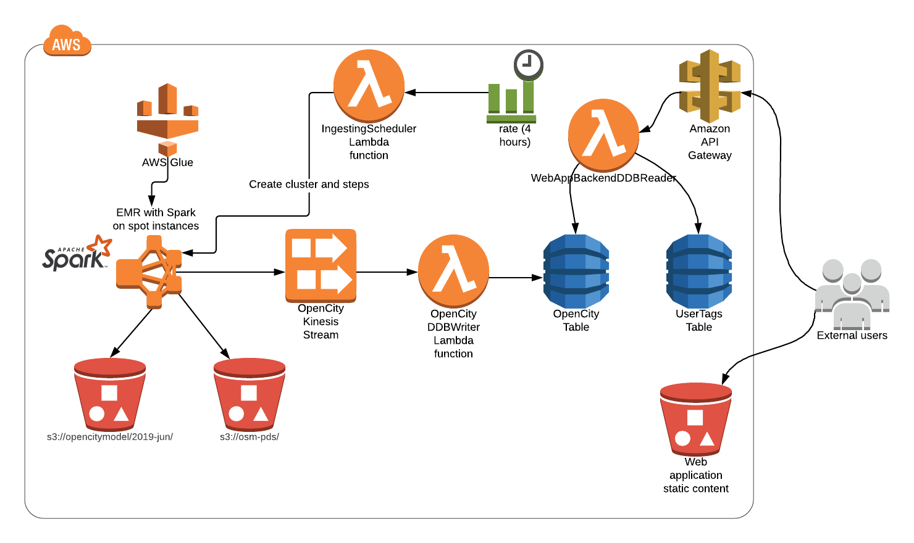

# OpenCity DynamoDB uploader

The project uploads [Open City Model database](https://github.com/opencitymodel/opencitymodel) to DynamoDB with EMR, Kinesis and Lambda.

Overall architecture: 

# Deployment

1. Create Glue table as described [here](https://github.com/opencitymodel/opencitymodel/blob/master/examples/Query-OpenCityModel-using-AWS-Athena.md)

2. Build [spark-kinesis-ingester](./spark-kinesis-ingester/) module:

``
mvn clean install
``

3. Put jar `/target/spark-kinesis-ingester-1.0-SNAPSHOT.jar` to your S3 bucket.

4. Prepare terraform config file `config.tfvars`:

``
region="es-east-1"
jar_path="s3://your_bucket/jars/spark-kinesis-ingester-1.0-SNAPSHOT.jar"
``

5. Apply it:

``
terraform init
terraform plan -var-file=config.tfvars
terraform apply -var-file=config.tfvars
``

